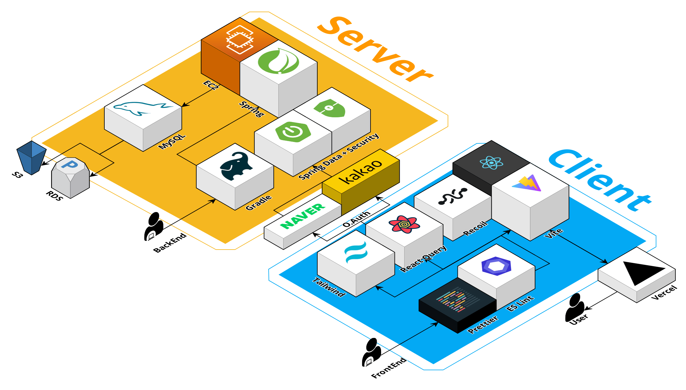

# 아띠클라이밍 🦊

🔗 [ahttyclimbing.com](https://www.ahttyclimbing.com/)

## 프로젝트 개요
배경: 경상북도 포항시 국우동에 위치한 암벽장 '아띠클라이밍'의 홍보 웹 페이지를 개발한다.

개발 기간: 2023.07 ~ 2023.09

### 프로젝트 아키텍처

### 주요 기능

- 서버 트래픽을 절감하기 위해 `SSR` 환경인 `Next.js` 로 시스템 설계
- AWS `Amplify` 와 `S3` 를 통한 저장소 관리
- 다양한 기기에서 지원을 위해 `반응형 웹` 으로 설계
- 사용자 인터렉티브 경험을 위해 `Farmers-motion` 을 통해 UI 구현
- 사용자 트래픽을 추적하기 위해 `Google Analytics` 적용
- 채널톡 라이브러리를 통한 SNS 연동 완료
- 컨텐츠 관리를 위한 `CMS` 기능 구현
- SEO 전략으로 검색 엔진 최적화 완료

 

## 페이지

### 메인

  

### 소개

  

### 요금

  

 

## R&R

|  |  |  |
| ------------------------------------------------------------------------------- | -------------------------------------------------------------------------------- | ------------------------------------------------------------------------------- |
| 
[이도경 (TL)](https://github.com/lee7198)
                 | 
[이원주](https://github.com/3o14)
                          | 
[최용원](https://github.com/ChoiYongWon)
                  |
| - 시스템 및 UI 설계  - 메인, 요금 페이지                                    | - 소개 페이지 구현  - 반응형 UI 설계                                         | - 관리자 페이지 구현  - 데이터 시각화                                       |
